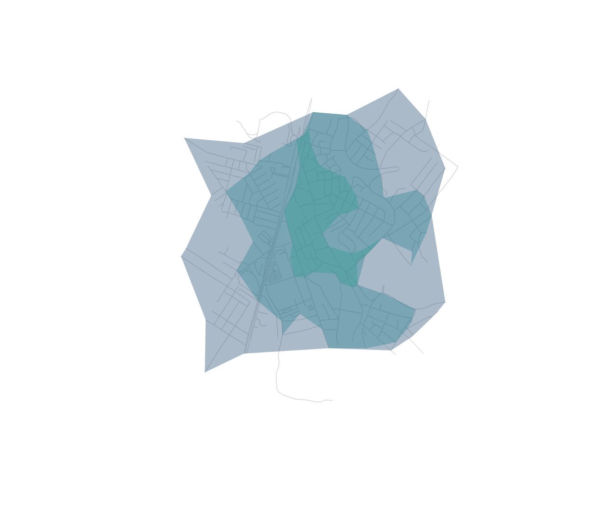

# Accessibility analysis

``` r

library(osmnxr)
```

A central use of street networks is **accessibility**: who can reach a
service, and how quickly (Foti 2014; Liu et al. 2022). The pattern is
always the same — snap facilities to the network, then solve shortest
paths or isochrones, weighted by distance or travel time. It underpins
studies of urban mobility, green mobility (“Fluxo Verde”), and access to
schools, hospitals and parks.

We use the bundled real network of central Olinda, Brazil, with travel
times, so this runs offline.

``` r

g <- ox_add_edge_travel_times(ox_example("olinda"))
```

## Travel-time service areas from a facility

Suppose a clinic sits near the centre. Its isochrones are the nested
areas reachable within each time budget:

``` r

clinic <- ox_nearest_nodes(g, x = -34.8553, y = -8.0089)
iso <- ox_isochrone(g, clinic, cutoffs = c(60, 120, 180), weight = "travel_time")
iso[c("cutoff", "n_nodes")]
#> Simple feature collection with 3 features and 2 fields
#> Geometry type: POLYGON
#> Dimension:     XY
#> Bounding box:  xmin: -34.86427 ymin: -8.017667 xmax: -34.84766 ymax: -7.999988
#> Geodetic CRS:  WGS 84
#>   cutoff n_nodes                       geometry
#> 1    180     468 POLYGON ((-34.86237 -8.0066...
#> 2    120     368 POLYGON ((-34.86141 -8.0064...
#> 3     60     104 POLYGON ((-34.85679 -8.0048...
```

``` r

plot(g, col = "grey85", lwd = 0.6)
plot(sf::st_geometry(iso), add = TRUE, border = NA,
     col = grDevices::adjustcolor(c("#0d3b66", "#1f7a8c", "#2a9d8f"), 0.35))
```



## Nearest facility for each origin

With several facilities and several demand points (homes), a distance
matrix gives the travel time from every home to every facility; the row
minimum is each home’s nearest facility:

``` r

homes <- ox_nearest_nodes(g,
  x = c(-34.8505, -34.852, -34.8585),
  y = c(-8.0125, -8.006, -8.011))
facilities <- ox_nearest_nodes(g,
  x = c(-34.8553, -34.8500),
  y = c(-8.0089, -8.0140))

m <- ox_distance_matrix(g, from = homes, to = facilities, weight = "travel_time")
round(m)                 # seconds, homes x facilities
#>            8945592343 5515883370
#> 1206764895         76         38
#> 1499391454         73        164
#> 7272198752         95        176
round(apply(m, 1, min))  # travel time to the nearest facility
#> 1206764895 1499391454 7272198752 
#>         38         73         95
```

## On real data

With network access, the facilities come straight from OpenStreetMap via
the `features` module, and the workflow is identical:

``` r

g <- ox_graph_from_place("Olinda, Brazil", network_type = "drive") |>
  ox_simplify() |>
  ox_add_edge_travel_times()

hospitals <- ox_features_from_place("Olinda, Brazil", tags = list(amenity = "hospital"))
xy <- sf::st_coordinates(hospitals)
origins <- ox_nearest_nodes(g, xy[, 1], xy[, 2])

# 10- and 20-minute drive-time service areas across all hospitals
ox_isochrone(g, origins, cutoffs = c(600, 1200), weight = "travel_time")
```

Overlay population on those polygons and you can quantify how many
people fall outside a 20-minute reach — the core question in
accessibility and territorial planning.

## References

Foti, F. (2014). *Behavioral framework for measuring walkability.* PhD
thesis, UC Berkeley.

Liu, S. et al. (2022). A generalized framework for measuring pedestrian
accessibility. *Geographical Analysis* 54.
