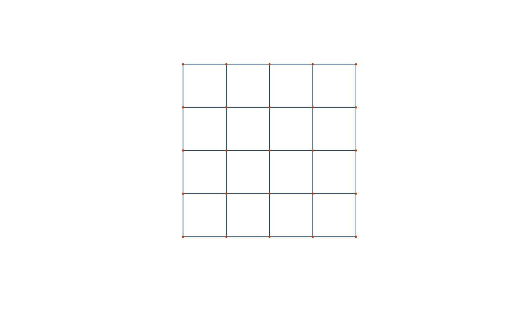

# Getting started with osmnxr

``` r

library(osmnxr)
```

## What is osmnxr?

`osmnxr` is *OSMnx for R*: it downloads, models, analyzes and visualizes
street networks from [OpenStreetMap](https://www.openstreetmap.org/).
The public API is tidyverse-friendly and returns
[`sf`](https://r-spatial.github.io/sf/) objects; the heavy graph
computation (routing, metrics, simplification) runs in a bundled **Rust
core**.

The central object is the `osm_graph`: a pair of `sf` tables (nodes and
edges) plus metadata.

## Working offline

Every part of the analysis API works without network access on a
synthetic grid, which is handy for learning and for reproducible
examples:

``` r

g <- example_osm_graph(n = 5)
g
#> 
#> ── osm_graph ───────────────────────────────────────────────────────────────────
#> 25 nodes, 80 edges
#> Network type: "drive"
#> Simplified: TRUE
#> CRS: "EPSG:3857"
```

``` r

plot(g, nodes = TRUE)
```



## Network statistics

``` r

ox_basic_stats(g)
#> # A tibble: 1 × 7
#>   n_nodes n_edges total_length mean_length mean_out_degree self_loops circuity
#>     <int>   <int>        <dbl>       <dbl>           <dbl>      <int>    <dbl>
#> 1      25      80         8000         100             3.2          0        1
```

## Routing

Find the nearest nodes to two coordinates, then compute the shortest
path (Dijkstra, in Rust):

``` r

from <- ox_nearest_nodes(g, x = 0,   y = 0)
to   <- ox_nearest_nodes(g, x = 400, y = 400)
ox_shortest_path(g, from, to)
#> [1]  1  6 11 16 17 18 19 20 25
```

Single-source distances to every node:

``` r

head(ox_distances(g, from))
#> # A tibble: 6 × 2
#>   osmid distance
#>   <int>    <dbl>
#> 1     1        0
#> 2     2      100
#> 3     3      200
#> 4     4      300
#> 5     5      400
#> 6     6      100
```

## Street orientation

The Shannon entropy of edge bearings summarises how ordered a street
grid is — low for a gridiron, high for an organic network:

``` r

ox_orientation_entropy(g)
#> [1] 1.511395
```

## Downloading real data

With network access, build a graph straight from a place name (this
contacts the OpenStreetMap Overpass API, so it is not run here):

``` r

g <- ox_graph_from_place("Olinda, Brazil", network_type = "drive")
plot(g)
ox_basic_stats(g)
```

See
[`?ox_graph_from_bbox`](https://strategicprojects.github.io/osmnxr/reference/ox_graph_from_bbox.md),
[`?ox_graph_from_point`](https://strategicprojects.github.io/osmnxr/reference/ox_graph_from_point.md)
and
[`?ox_geocode`](https://strategicprojects.github.io/osmnxr/reference/ox_geocode.md)
for the other download entry points, and
[`ox_settings()`](https://strategicprojects.github.io/osmnxr/reference/ox_settings.md)
to configure endpoints, timeouts and caching.
