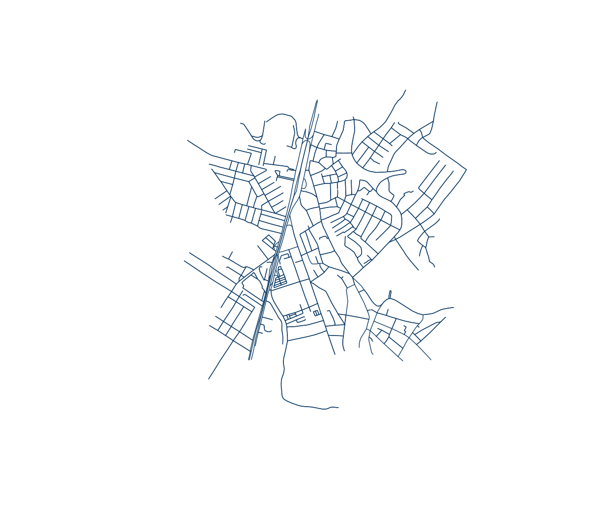
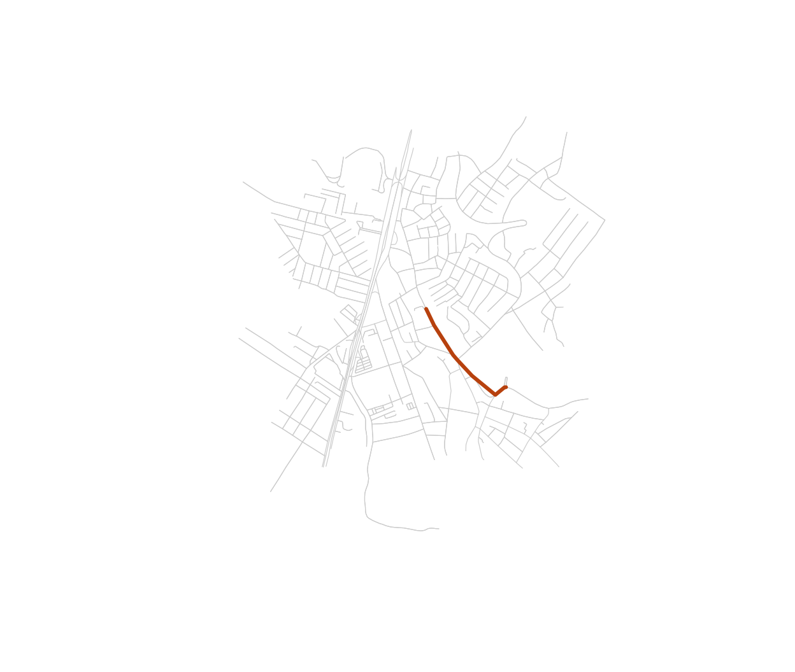

# Getting started with osmnxr

``` r

library(osmnxr)
```

## What is osmnxr?

`osmnxr` is *OSMnx for R*: it downloads, models, analyzes and visualizes
street networks from [OpenStreetMap](https://www.openstreetmap.org/).
The public API is tidyverse-friendly and returns
[`sf`](https://r-spatial.github.io/sf/) objects; the heavy graph
computation (routing, metrics, simplification) runs in a bundled **Rust
core**.

The central object is the `osm_graph`: a pair of `sf` tables (nodes and
edges) plus metadata.

## A real network

The usual entry point is a place name, which downloads from
OpenStreetMap:

``` r

g <- ox_graph_from_place("Olinda, Brazil", network_type = "drive")
g <- ox_simplify(g)
```

So this vignette runs offline, we load that exact network — the historic
centre of Olinda, Brazil — from the copy bundled with the package:

``` r

g <- ox_example("olinda")
g
#> 
#> ── osm_graph ───────────────────────────────────────────────────────────────────
#> 498 nodes, 1191 edges
#> Network type: "unknown"
#> Simplified: FALSE
#> CRS: "WGS 84"
```

``` r

plot(g)
```



## Network statistics

``` r

ox_basic_stats(g)
#> # A tibble: 1 × 7
#>   n_nodes n_edges total_length mean_length mean_out_degree self_loops circuity
#>     <int>   <int>        <dbl>       <dbl>           <dbl>      <int>    <dbl>
#> 1     498    1191       95484.        80.2            2.39          1     1.06
```

## Routing

Snap coordinates to graph nodes, then compute the shortest path
(Dijkstra, in Rust):

``` r

orig <- ox_nearest_nodes(g, x = -34.8553, y = -8.0089)
dest <- ox_nearest_nodes(g, x = -34.8505, y = -8.0125)
route <- ox_shortest_path(g, orig, dest)
length(route) # nodes along the route
#> [1] 8
```

``` r

route_xy <- sf::st_coordinates(g$nodes)[match(route, g$nodes$osmid), ]
plot(g, col = "grey80", lwd = 0.6)
lines(route_xy, col = "#b7410e", lwd = 3)
```



## Where to next

- [Routing and
  isochrones](https://strategicprojects.github.io/osmnxr/articles/routing-and-isochrones.md)
  — travel time, route alternatives, service areas.
- [Urban
  metrics](https://strategicprojects.github.io/osmnxr/articles/urban-metrics.md)
  — circuity, centrality, chokepoints.
- [Street
  orientation](https://strategicprojects.github.io/osmnxr/articles/street-orientation.md)
  — grid order across cities.
- [Accessibility
  analysis](https://strategicprojects.github.io/osmnxr/articles/accessibility.md)
  — access to schools, hospitals, parks.
- [Features and points of
  interest](https://strategicprojects.github.io/osmnxr/articles/features-and-pois.md)
  — download POIs and buildings.

No network needed at all?
[`example_osm_graph()`](https://strategicprojects.github.io/osmnxr/reference/example_osm_graph.md)
builds a synthetic grid for quick experiments.
