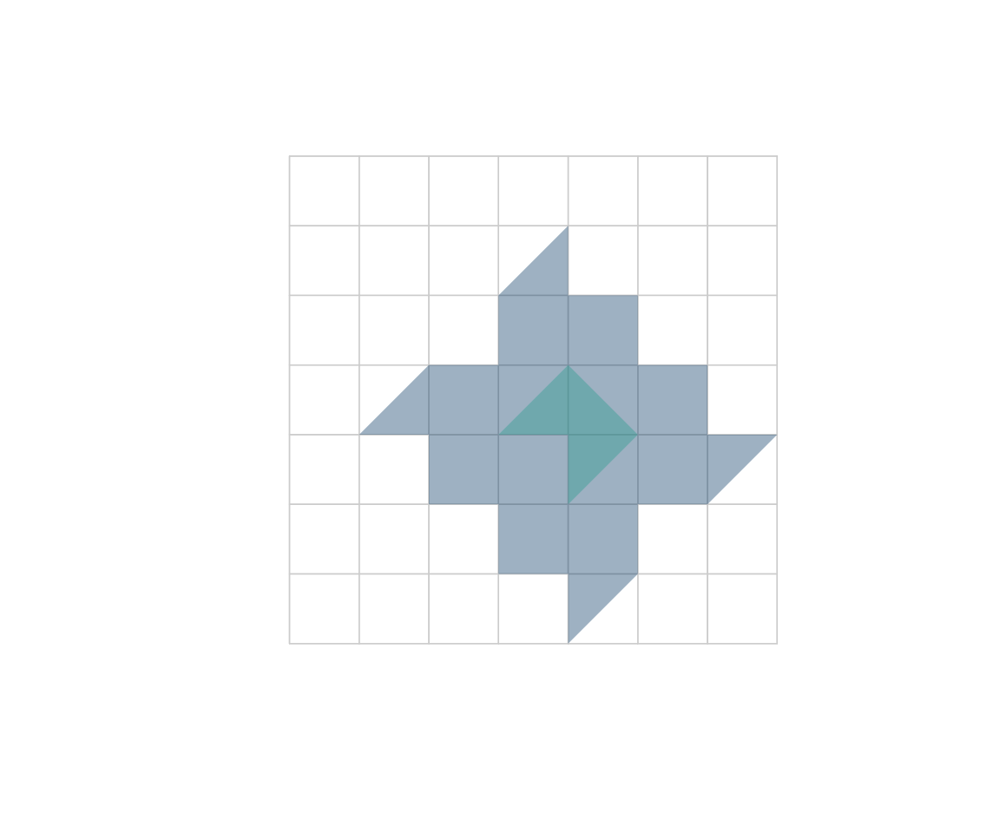

# Routing and isochrones

``` r

library(osmnxr)
```

This article uses the offline synthetic grid so it runs anywhere. With a
real network from
[`ox_graph_from_place()`](https://strategicprojects.github.io/osmnxr/reference/ox_graph_from_place.md)
the workflow is identical.

``` r

g <- example_osm_graph(n = 8, spacing = 100)
```

## Shortest paths

Snap coordinates to graph nodes, then route between them. Routing runs
in the Rust core (Dijkstra).

``` r

from <- ox_nearest_nodes(g, x = 0,   y = 0)
to   <- ox_nearest_nodes(g, x = 700, y = 700)
ox_shortest_path(g, from, to)
#>  [1]  1  9 17 25 26 27 35 43 44 52 60 61 62 63 64
```

### Route alternatives

[`ox_k_shortest_paths()`](https://strategicprojects.github.io/osmnxr/reference/ox_k_shortest_paths.md)
returns the *k* loopless shortest paths (Yen’s algorithm) as a tidy
tibble with a list-column of node ids:

``` r

ox_k_shortest_paths(g, from, to, k = 3)
#> # A tibble: 3 × 3
#>    rank  cost path      
#>   <int> <dbl> <list>    
#> 1     1  1400 <int [15]>
#> 2     2  1400 <int [15]>
#> 3     3  1400 <int [15]>
```

## Travel time instead of distance

Attach speeds by road class and derive per-edge travel times, then route
by time by passing `weight = "travel_time"`.

``` r

g <- ox_add_edge_travel_times(g)
head(g$edges[c("highway", "length", "speed_kph", "travel_time")])
#> Simple feature collection with 6 features and 4 fields
#> Geometry type: LINESTRING
#> Dimension:     XY
#> Bounding box:  xmin: 0 ymin: 0 xmax: 300 ymax: 100
#> Projected CRS: WGS 84 / Pseudo-Mercator
#>       highway length speed_kph travel_time                    geometry
#> 1 residential    100        30          12     LINESTRING (0 0, 100 0)
#> 2 residential    100        30          12     LINESTRING (0 0, 0 100)
#> 3 residential    100        30          12   LINESTRING (100 0, 200 0)
#> 4 residential    100        30          12 LINESTRING (100 0, 100 100)
#> 5 residential    100        30          12   LINESTRING (200 0, 300 0)
#> 6 residential    100        30          12 LINESTRING (200 0, 200 100)

ox_shortest_path(g, from, to, weight = "travel_time")
#>  [1]  1  9 17 25 26 27 35 43 44 52 60 61 62 63 64
```

## Distance matrices

Many-to-many shortest-path costs in one call:

``` r

hubs <- ox_nearest_nodes(g, x = c(0, 700, 0), y = c(0, 0, 700))
ox_distance_matrix(g, from = hubs, to = hubs)
#>      1   57    8
#> 1    0  700  700
#> 57 700    0 1400
#> 8  700 1400    0
```

## Isochrones (service areas)

An isochrone is the area reachable from one or more origins within a
cost budget.
[`ox_isochrone()`](https://strategicprojects.github.io/osmnxr/reference/ox_isochrone.md)
finds the reachable nodes (Rust Dijkstra) and hulls them; with
`travel_time` as the weight, cutoffs are in seconds.

``` r

center <- ox_nearest_nodes(g, x = 350, y = 350)
iso <- ox_isochrone(g, center, cutoffs = c(150, 350), weight = "length")
iso[c("cutoff", "n_nodes")]
#> Simple feature collection with 2 features and 2 fields
#> Geometry type: POLYGON
#> Dimension:     XY
#> Bounding box:  xmin: 100 ymin: 0 xmax: 700 ymax: 600
#> Projected CRS: WGS 84 / Pseudo-Mercator
#>   cutoff n_nodes                       geometry
#> 1    350      25 POLYGON ((200 300, 100 300,...
#> 2    150       5 POLYGON ((400 300, 300 300,...
```

``` r

plot(g, col = "grey80")
plot(sf::st_geometry(iso), add = TRUE,
     col = grDevices::adjustcolor(c("#0d3b66", "#2a9d8f"), 0.4), border = NA)
```



This is the core of accessibility analysis: with origins at schools or
hospitals and `travel_time` cutoffs, the polygons describe who can reach
a service within, say, 10 or 20 minutes — the basis for “Fluxo Verde”
and territorial-planning studies.
