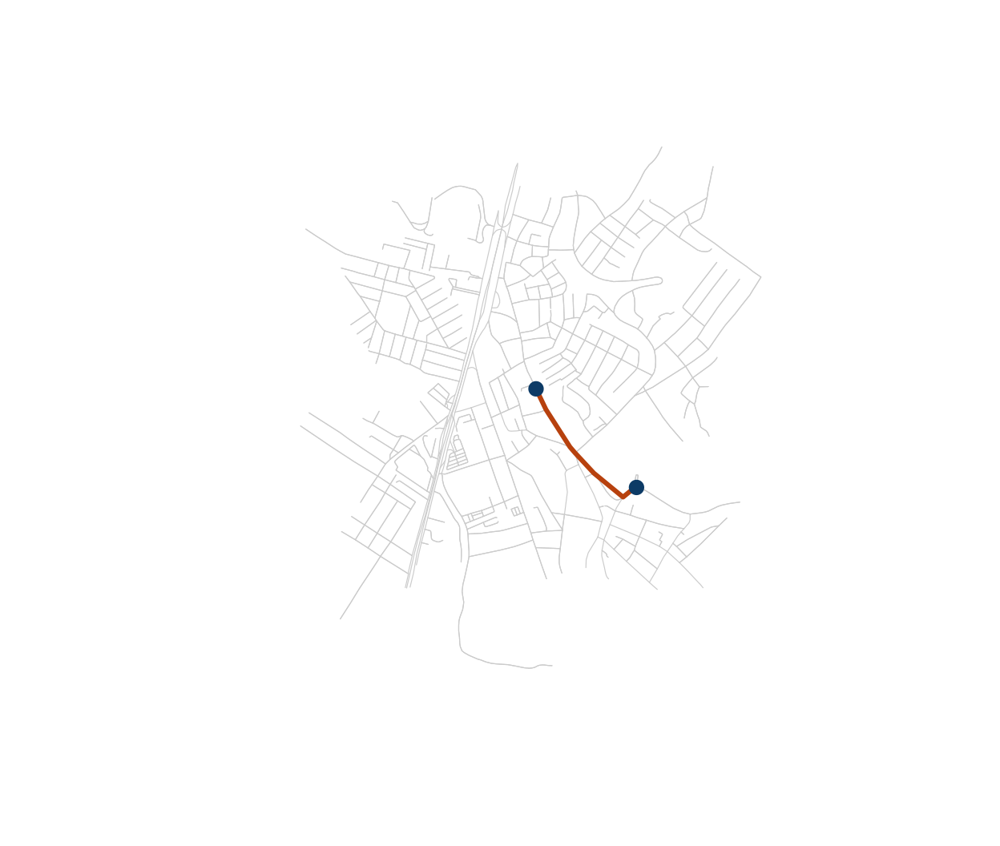
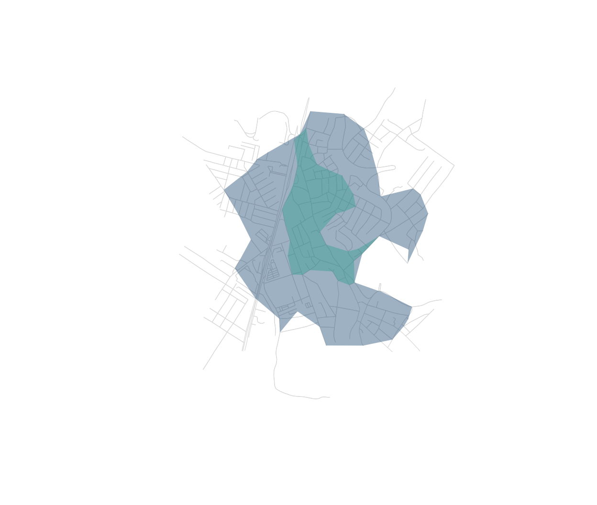

# Routing and isochrones

``` r

library(osmnxr)
g <- ox_example("olinda")
```

Routing in `osmnxr` runs in the Rust core (Dijkstra, Yen, multi-source).
We use the bundled real network of central Olinda, Brazil, so this runs
offline.

## Shortest path by distance

Snap two coordinates to the nearest nodes, then route between them:

``` r

orig <- ox_nearest_nodes(g, x = -34.8553, y = -8.0089)
dest <- ox_nearest_nodes(g, x = -34.8505, y = -8.0125)
route <- ox_shortest_path(g, orig, dest, weight = "length")
length(route) # nodes along the route
#> [1] 8
```

``` r

route_xy <- sf::st_coordinates(g$nodes)[match(route, g$nodes$osmid), ]
plot(g, col = "grey80", lwd = 0.6)
lines(route_xy, col = "#b7410e", lwd = 3)
points(route_xy[c(1, nrow(route_xy)), ], pch = 19, col = "#0d3b66", cex = 1.2)
```



## Travel time instead of distance

Real routing usually minimises *time*, not distance. Impute free-flow
speeds from each road’s class, derive per-edge travel times, then route
on them (Boeing 2025, `routing` module):

``` r

g <- ox_add_edge_travel_times(g)
head(g$edges[c("highway", "length", "speed_kph", "travel_time")])
#> Simple feature collection with 6 features and 4 fields
#> Geometry type: LINESTRING
#> Dimension:     XY
#> Bounding box:  xmin: -34.85889 ymin: -8.00763 xmax: -34.85675 ymax: -8.006154
#> Geodetic CRS:  WGS 84
#>       highway    length speed_kph travel_time                       geometry
#> 1       trunk 143.05987        80    6.437694 LINESTRING (-34.85776 -8.00...
#> 2       trunk  39.20625        80    1.764281 LINESTRING (-34.85716 -8.00...
#> 3 residential 108.81964        30   13.058356 LINESTRING (-34.85716 -8.00...
#> 4 residential 108.81964        30   13.058356 LINESTRING (-34.85675 -8.00...
#> 5    tertiary  47.55902        40    4.280311 LINESTRING (-34.85867 -8.00...
#> 6    tertiary  47.55902        40    4.280311 LINESTRING (-34.85889 -8.00...

route_t <- ox_shortest_path(g, orig, dest, weight = "travel_time")
identical(route_t, route) # may differ: the fastest route is not always shortest
#> [1] TRUE
```

## Route alternatives

[`ox_k_shortest_paths()`](https://strategicprojects.github.io/osmnxr/reference/ox_k_shortest_paths.md)
returns the *k* shortest loopless routes (Yen’s algorithm) — useful for
comparing options or modelling redundancy:

``` r

ox_k_shortest_paths(g, orig, dest, k = 3, weight = "travel_time")
#> # A tibble: 3 × 3
#>    rank  cost path      
#>   <int> <dbl> <list>    
#> 1     1  72.1 <dbl [8]> 
#> 2     2  90.7 <dbl [11]>
#> 3     3 111.  <dbl [16]>
```

## Isochrones (service areas)

An isochrone is the area reachable from an origin within a budget. With
`travel_time` as the weight, cutoffs are in seconds — here, 1- and
2-minute drive-time service areas from a central point:

``` r

centre <- ox_nearest_nodes(g, x = -34.8553, y = -8.0089)
iso <- ox_isochrone(g, centre, cutoffs = c(60, 120), weight = "travel_time")
iso[c("cutoff", "n_nodes")]
#> Simple feature collection with 2 features and 2 fields
#> Geometry type: POLYGON
#> Dimension:     XY
#> Bounding box:  xmin: -34.86146 ymin: -8.016166 xmax: -34.84852 ymax: -8.001461
#> Geodetic CRS:  WGS 84
#>   cutoff n_nodes                       geometry
#> 1    120     368 POLYGON ((-34.86141 -8.0064...
#> 2     60     104 POLYGON ((-34.85679 -8.0048...
```

``` r

plot(g, col = "grey85", lwd = 0.6)
plot(sf::st_geometry(iso), add = TRUE, border = NA,
     col = grDevices::adjustcolor(c("#0d3b66", "#2a9d8f"), 0.4))
```



## Many-to-many distances

For accessibility work you often need a full origin–destination matrix
in one call (see the
[Accessibility](https://strategicprojects.github.io/osmnxr/articles/accessibility.md)
article):

``` r

hubs <- ox_nearest_nodes(g,
  x = c(-34.8553, -34.8505, -34.852),
  y = c(-8.0089, -8.0125, -8.006))
round(ox_distance_matrix(g, hubs, hubs, weight = "travel_time"))
#>            8945592343 1206764895 1499391454
#> 8945592343          0         72         73
#> 1206764895         76          0        134
#> 1499391454         73        129          0
```

## References

Boeing, G. (2025). Modeling and analyzing urban networks and amenities
with OSMnx. *Geographical Analysis*.
