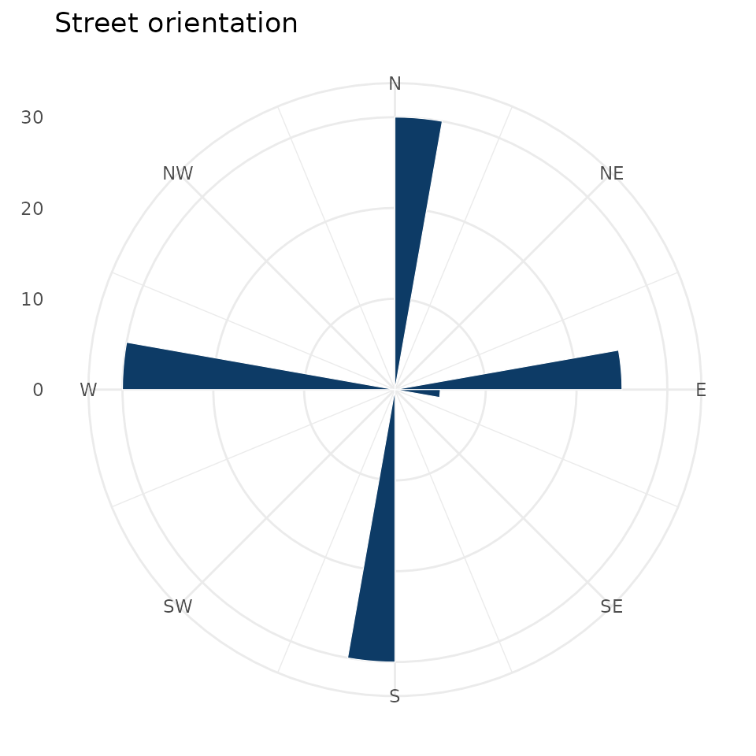

# Street orientation

``` r

library(osmnxr)
```

Street-orientation analysis asks how ordered a city’s grid is. `osmnxr`
computes the compass bearing of every edge and summarises the
distribution with Shannon entropy, all in the Rust core.

## Bearings

``` r

g <- example_osm_graph(n = 6, spacing = 100)
b <- ox_bearings(g)
table(round(b))
#> 
#>   0  90 180 270 
#>  30  30  30  30
```

A regular grid points in only a few directions, so its bearings cluster.

## Orientation entropy

Entropy (in nats) is low for an ordered gridiron and high for a
disordered, organic network. The perfectly aligned grid sits near the
low end:

``` r

ox_orientation_entropy(g)
#> [1] 1.498935
```

For comparison, a network whose streets ran in every direction equally
would approach `log(num_bins)`:

``` r

log(36)
#> [1] 3.583519
```

## Rose plot

[`ox_plot_orientation()`](https://strategicprojects.github.io/osmnxr/reference/ox_plot_orientation.md)
draws the classic polar histogram of bearings (requires `ggplot2`):

``` r

ox_plot_orientation(g, num_bins = 36)
```



With a real network this is where the character of a city shows:
download one with
[`ox_graph_from_place()`](https://strategicprojects.github.io/osmnxr/reference/ox_graph_from_place.md),
simplify it, and plot:

``` r

city <- ox_graph_from_place("Manhattan, New York, USA", network_type = "drive")
city <- ox_simplify(city)
ox_orientation_entropy(city) # low: a famous grid
ox_plot_orientation(city)
```
