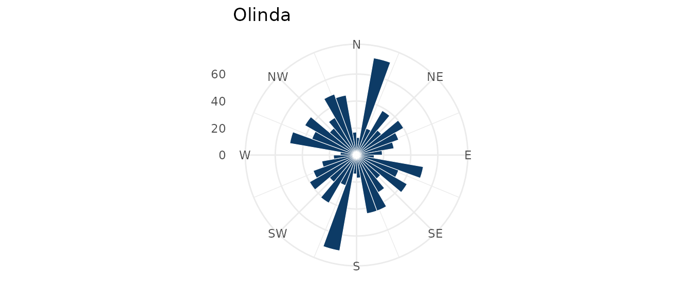
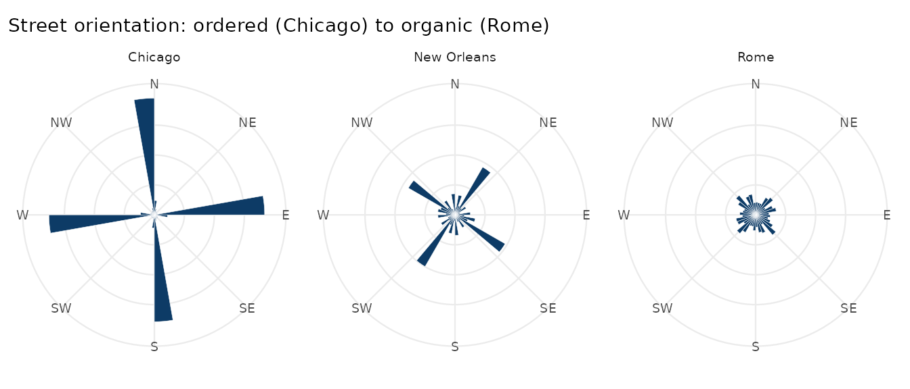

# Street orientation

``` r

library(osmnxr)
```

How ordered is a city’s street grid? Following Boeing (2019, 2025),
`osmnxr` measures this with the **compass bearing** of every street and
the **Shannon entropy** of their distribution: low entropy for a rigid
gridiron, high entropy for an organic, winding network.

## A real first network

`ox_example("olinda")` loads a small real network (the historic centre
of Olinda, Brazil) bundled with the package, so this runs without
network access:

``` r

g <- ox_example("olinda")
ox_orientation_entropy(g)
#> [1] 3.486313
```

``` r

ox_plot_orientation(g, title = "Olinda")
```



Olinda’s colonial street pattern is irregular, so its rose plot points
in many directions and its entropy is high.

## Comparing cities

The package bundles the bearings of three cities that span the spectrum
— the same comparison as Figure 2 of Boeing (2025). These are real
bearings, sampled from each city’s drivable network:

``` r

cities <- readRDS(system.file("extdata", "city_orientations.rds", package = "osmnxr"))
ent <- tapply(cities$bearing, cities$city, ox_orientation_entropy)
round(ent, 3)
#>     Chicago New Orleans        Rome 
#>       2.473       3.272       3.550
```

Chicago’s relentless grid gives the lowest entropy; New Orleans, bending
along the Mississippi, sits in the middle; Rome’s ancient organic core
is highest — near the theoretical maximum of `log(36) =` 3.58.

``` r

library(ggplot2)

bins <- 36; bw <- 360 / bins
cities$sector <- (floor((cities$bearing %% 360) / bw) + 0.5) * bw
counts <- as.data.frame(table(city = cities$city, sector = cities$sector))
counts$sector <- as.numeric(as.character(counts$sector))

ggplot(counts, aes(sector, Freq)) +
  geom_col(width = bw, fill = "#0d3b66", colour = "white", linewidth = 0.1) +
  coord_polar(start = 0) +
  scale_x_continuous(limits = c(0, 360), breaks = seq(0, 315, 45),
                     labels = c("N", "NE", "E", "SE", "S", "SW", "W", "NW")) +
  facet_wrap(~ city) +
  labs(x = NULL, y = NULL,
       title = "Street orientation: ordered (Chicago) to organic (Rome)") +
  theme_minimal(base_size = 9) +
  theme(axis.text.y = element_blank(), panel.grid.minor = element_blank())
```



## On your own city

With network access, compute this for any place straight from
OpenStreetMap:

``` r

g <- ox_graph_from_place("Manhattan, New York, USA", network_type = "drive") |>
  ox_simplify()
ox_orientation_entropy(g) # low: a famous grid
ox_plot_orientation(g, title = "Manhattan")
```

## References

Boeing, G. (2019). Urban spatial order: street network orientation,
configuration, and entropy. *Applied Network Science* 4(1).

Boeing, G. (2025). Modeling and analyzing urban networks and amenities
with OSMnx. *Geographical Analysis*.
