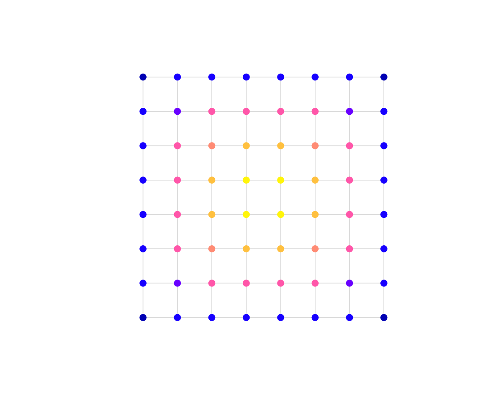

# Urban metrics

``` r

library(osmnxr)
```

`osmnxr` summarises a street network with a handful of metrics, all
computed in the Rust core. This article uses the offline grid; the
workflow is identical on a network from
[`ox_graph_from_place()`](https://strategicprojects.github.io/osmnxr/reference/ox_graph_from_place.md).

``` r

g <- example_osm_graph(n = 8, spacing = 100)
```

## Basic statistics

[`ox_basic_stats()`](https://strategicprojects.github.io/osmnxr/reference/ox_basic_stats.md)
reports node and edge counts, total and mean edge length, mean
out-degree, self-loops and average circuity:

``` r

ox_basic_stats(g)
#> # A tibble: 1 × 7
#>   n_nodes n_edges total_length mean_length mean_out_degree self_loops circuity
#>     <int>   <int>        <dbl>       <dbl>           <dbl>      <int>    <dbl>
#> 1      64     224        22400         100             3.5          0        1
```

## Circuity

Circuity is the ratio of street length to straight-line distance between
edge endpoints. A value of `1` means perfectly straight streets; higher
values mean more winding ones. A grid is exactly straight:

``` r

ox_circuity(g)
#> [1] 1
```

## Centrality

Which intersections carry the most through-traffic, and which are most
central?
[`ox_centrality()`](https://strategicprojects.github.io/osmnxr/reference/ox_centrality.md)
returns betweenness (Brandes’ algorithm) and closeness:

``` r

ct <- ox_centrality(g, normalized = TRUE)
ct[order(-ct$betweenness), ][1:5, ]
#> # A tibble: 5 × 3
#>   osmid betweenness closeness
#>   <int>       <dbl>     <dbl>
#> 1    36       0.153   0.00246
#> 2    28       0.153   0.00246
#> 3    29       0.153   0.00246
#> 4    37       0.153   0.00246
#> 5    20       0.133   0.00232
```

Join the scores back onto the nodes to map them:

``` r

nodes <- g$nodes
nodes$betweenness <- ct$betweenness[match(nodes$osmid, ct$osmid)]
plot(g, col = "grey85")
plot(nodes["betweenness"], pch = 19, add = TRUE)
```



The most between-central nodes sit in the core of the grid — exactly
where shortest paths concentrate. On a real network this highlights
structurally important junctions for mobility and resilience planning.
