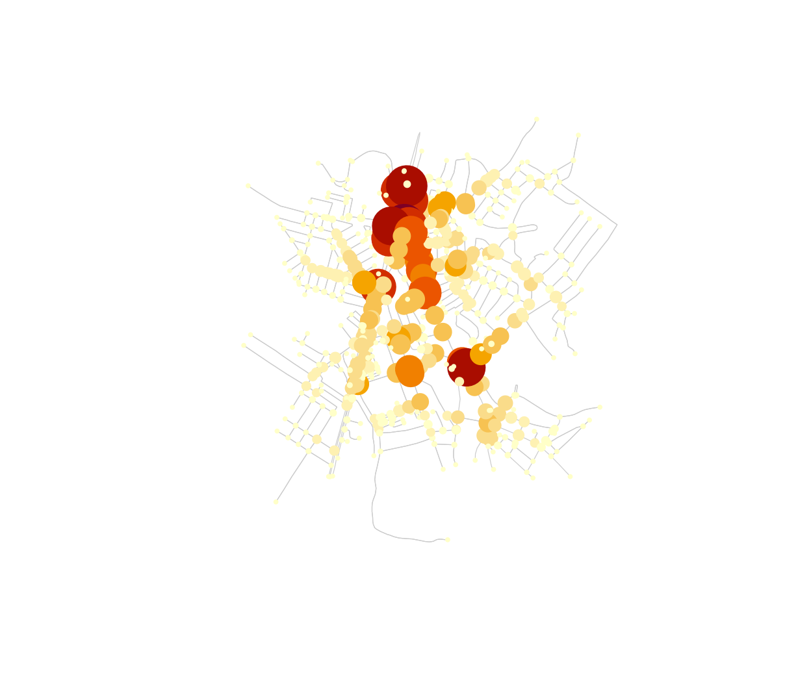

# Urban metrics

``` r

library(osmnxr)
```

`osmnxr` summarises a street network with the geometric and topological
measures used in urban morphology (Boeing 2025). We use a bundled real
network — the centre of Olinda, Brazil — so everything here runs
offline.

``` r

g <- ox_example("olinda")
g
#> 
#> ── osm_graph ───────────────────────────────────────────────────────────────────
#> 498 nodes, 1191 edges
#> Network type: "unknown"
#> Simplified: FALSE
#> CRS: "WGS 84"
```

## Basic statistics

``` r

ox_basic_stats(g)
#> # A tibble: 1 × 7
#>   n_nodes n_edges total_length mean_length mean_out_degree self_loops circuity
#>     <int>   <int>        <dbl>       <dbl>           <dbl>      <int>    <dbl>
#> 1     498    1191       95484.        80.2            2.39          1     1.06
```

The pieces of this summary are standard urban indicators:

- **`n_nodes` / `n_edges`** — intersections and street segments.
  Intersection density (nodes per km²) is the most common measure of
  network “grain”.
- **`mean_length`** — average street segment length, a proxy for block
  size.
- **`total_length`** — total street length; divide by area for street
  density.
- **`circuity`** — how much streets deviate from straight lines.

``` r

area_km2 <- as.numeric(sf::st_area(sf::st_convex_hull(sf::st_union(g$nodes)))) / 1e6
n_intersections <- sum(g$nodes$osmid %in% c(g$edges$u, g$edges$v))
n_intersections / area_km2 # intersections per km^2
#> [1] 151.0356
```

## Circuity

Circuity is total street length over straight-line distance between
segment endpoints. A value near `1` means straight streets; higher means
more winding:

``` r

ox_circuity(g)
#> [1] 1.061807
```

## Centrality: finding chokepoints

Betweenness centrality counts the share of shortest paths passing
through each node. Its maximum highlights structural chokepoints — “a
bridge connecting a city’s halves” (Boeing & Ha 2024) — that are single
points of failure for mobility and resilience.

``` r

ct <- ox_centrality(g, type = "betweenness", normalized = TRUE)
ct[order(-ct$betweenness), ][1:5, ]
#> # A tibble: 5 × 2
#>        osmid betweenness
#>        <dbl>       <dbl>
#> 1 6146825103       0.183
#> 2 5662175659       0.178
#> 3 8291701581       0.165
#> 4 1572677068       0.163
#> 5 5662175651       0.160
```

Map it: the darkest, largest nodes carry the most through-traffic.

``` r

nodes <- g$nodes
nodes$betweenness <- ct$betweenness[match(nodes$osmid, ct$osmid)]
plot(g, col = "grey80", lwd = 0.6)
plot(nodes["betweenness"], pch = 19,
     cex = 0.4 + 4 * nodes$betweenness / max(nodes$betweenness),
     pal = function(n) hcl.colors(n, "YlOrRd", rev = TRUE), add = TRUE)
```



The high-betweenness nodes trace the through-routes that hold the
network together — exactly the junctions a planner would protect or
reinforce.

## References

Boeing, G. (2025). Modeling and analyzing urban networks and amenities
with OSMnx. *Geographical Analysis*.

Boeing, G., & Ha, J. (2024). Resilient by design: simulating street
network disruptions across every urban area in the world.
*Transportation Research Part A*.
