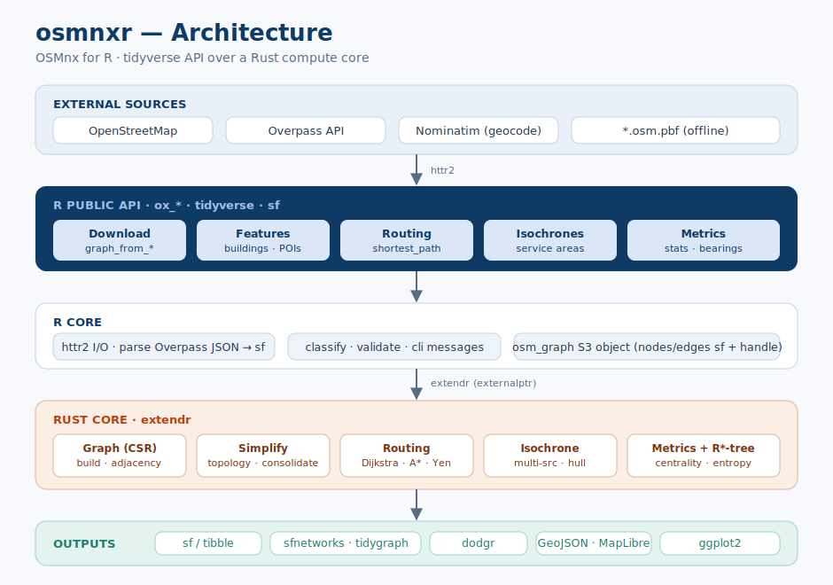
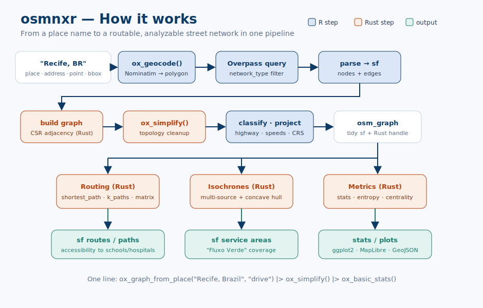

# osmnxr

**osmnxr** is *OSMnx for R*: a tidyverse-friendly toolkit, inspired by
the [OSMnx](https://osmnx.readthedocs.io/) Python library, to
**download, model, simplify, analyze and visualize** street networks and
other geospatial features from
[OpenStreetMap](https://www.openstreetmap.org/).

It is a **reimplementation** — not a Python wrapper. Heavy graph
computation (routing, simplification, metrics) runs in a bundled **Rust
core** via [extendr](https://extendr.rs/), so there is no Python runtime
to manage. Everything you get back is tidy
[`sf`](https://r-spatial.github.io/sf/).

## Installation

`osmnxr` builds from source and needs the **Rust toolchain**
([rustup](https://rustup.rs/)) at install time.

``` r

# install.packages("remotes")
remotes::install_github("StrategicProjects/osmnxr")
```

## Quick start

``` r

library(osmnxr)

# Download a drivable street network for a place
g <- ox_graph_from_place("Olinda, Brazil", network_type = "drive")
g
plot(g)

# Route between two points (Rust Dijkstra)
from <- ox_nearest_nodes(g, x = -34.85, y = -8.01)
to   <- ox_nearest_nodes(g, x = -34.84, y = -8.00)
ox_shortest_path(g, from, to)

# Urban metrics
ox_basic_stats(g)
ox_orientation_entropy(g)   # street-grid order/disorder
```

No network access? Explore the whole API offline with a synthetic grid:

``` r

g <- example_osm_graph()
ox_basic_stats(g)
ox_shortest_path(g, ox_nearest_nodes(g, 0, 0), ox_nearest_nodes(g, 300, 300))
```

## How it works

`osmnxr` is split into a tidy R API over a Rust compute core:



The pipeline, from a place name to an analyzable network:



## Related work

`osmnxr` complements the R geospatial stack — it can hand graphs to
[`sfnetworks`](https://luukvdmeer.github.io/sfnetworks/),
[`tidygraph`](https://tidygraph.data-imaginist.com/) and
[`dodgr`](https://urbananalyst.github.io/dodgr/), and downloads via the
same Overpass API used by
[`osmdata`](https://docs.ropensci.org/osmdata/).

## License

MIT © Andre Leite and contributors / StrategicProjects.
